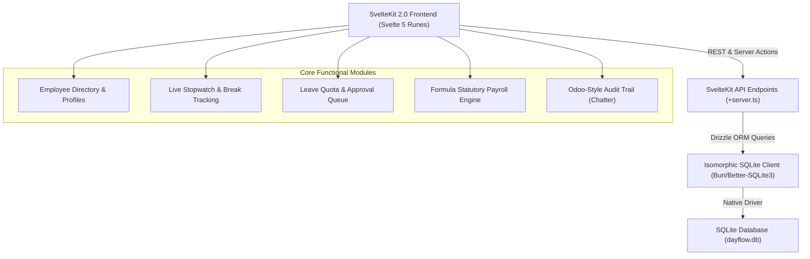
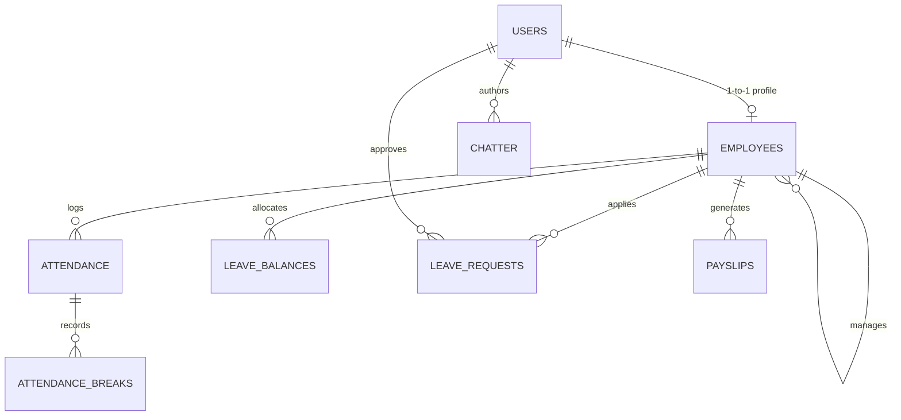

# Dayflow HRMS - System Architecture & Technical Specifications

Dayflow HRMS is an enterprise-grade Human Resource Management Suite engineered with **SvelteKit (Svelte 5 Runes)**, **Tailwind CSS**, **Drizzle ORM**, and an isomorphic **SQLite** database client.

---

## 1. High-Level System Architecture

---

## 2. Database Entity-Relationship Model (Drizzle ORM)

---

## 3. Statutory Indian Compensation Formula Engine

All payroll computations are strictly governed by statutory formulas:

$$\begin{aligned}
\text{Basic Salary} &= 50\% \times \text{Pro-Rated Monthly Wage} \\
\text{House Rent Allowance (HRA)} &= 50\% \times \text{Basic Salary} = 25\% \times \text{Monthly Wage} \\
\text{Standard Allowance} &= ₹4,167 \text{ (Fixed)} \\
\text{Performance Bonus} &= 8.33\% \times \text{Basic Salary} \\
\text{Leave Travel Allowance (LTA)} &= 8.33\% \times \text{Basic Salary} \\
\text{Fixed Special Allowance} &= \max(0, \text{Gross} - \sum \text{Allowances}) \\
\text{Employee PF} &= 12\% \times \text{Basic Salary} \\
\text{Employer PF} &= 12\% \times \text{Basic Salary} \\
\text{Professional Tax (PT)} &= \begin{cases} ₹200 & \text{if Wage} > ₹15,000 \\ 0 & \text{otherwise} \end{cases} \\
\text{Payable Days} &= \text{Total Working Days} - \text{LOP Days} - \text{Unexcused Absent Days}
\end{aligned}$$

---

## 4. REST API Endpoint Specifications

| Endpoint | Method | Description |
| :--- | :---: | :--- |
| `/api/employees` | `GET` | Filter and paginate employees by department, query, and status |
| `/api/employees/update` | `POST` | Update personal, banking, or salary configurations with audit logging |
| `/api/employees/chatter` | `GET`, `POST` | Retrieve and append audit logs and discussion notes |
| `/api/attendance/break` | `POST`, `GET` | Start/end breaks with 60-minute policy threshold alert |
| `/api/leaves` | `GET`, `POST` | Fetch balance cards and submit leave requests |
| `/api/leaves/approve` | `POST` | Approve/reject leave requests with automatic attendance sync |
| `/api/leaves/sync` | `POST` | Batch synchronize approved leave records into daily attendance |
| `/api/payroll/calculate` | `POST` | On-demand statutory salary calculation for single employee |
| `/api/payroll/batch` | `POST` | One-click monthly batch payroll generation across departments |

---

## 5. Multi-Developer Git DAG Architecture

Dayflow HRMS was built collaboratively across 4 specialized engineering streams:
1. `feature/employee-directory`: Arnav Kini (Dev 2)
2. `feature/attendance-systray`: Sanchit Kumar Pandey (Dev 3)
3. `feature/leave-management`: Ankit Kumar Sah (Dev 4)
4. `feature/payroll-analytics`: Priyanshu Roy (Lead)
