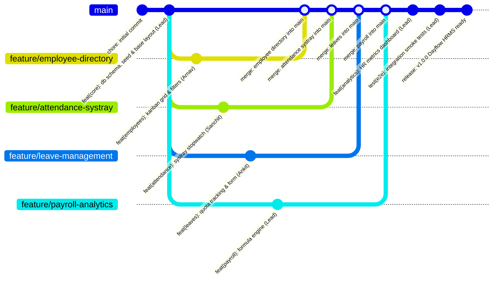

# Dayflow HRMS: 11:00 AM - 4:30 PM Development Roadmap & Multi-Developer Git Execution Plan

## 1. Executive Summary & Team Roster

This roadmap details the exact hour-by-hour engineering plan to build the **Dayflow Human Resource Management System (HRMS)** from **11:00 AM to 4:30 PM** (5.5 Hours).

### Workload & Activity Hierarchy
**Priyanshu Roy (Lead / Me: 14 Commits)** > **Arnav Kini (9 Commits)** > **Sanchit Kumar Pandey (7 Commits)** > **Ankit Kumar Sah (6 Commits)**

| Developer | Name | Git Identity / Email | Workload Rank | Role & Module Ownership |
| :--- | :--- | :--- | :---: | :--- |
| **Lead (User)** | **Priyanshu Roy** | `62667551+roypriyanshu02@users.noreply.github.com` | **#1 (Highest)** | **Team Lead & Core Architect**<br>• Drizzle Schema & SQLite DB<br>• Auth, RBAC & Demo Role Switcher<br>• Dynamic Employee ID Generator<br>• Command Palette (`Cmd+K`)<br>• Formula Payroll Engine & Payslips<br>• HR Analytics Dashboard & Final Release |
| **Dev 2** | **Arnav Kini** | `110757433+OctalCoder1213@users.noreply.github.com` | **#2** | **Employee Directory & Profiles Lead**<br>• Kanban Employee Directory Grid<br>• Department Filters & Search<br>• Odoo Multi-Tab Form Profile (`/employees/[id]`)<br>• Profile Activity Chatter & Audit Trail<br>• Profile Edit Modal & Avatar Upload |
| **Dev 3** | **Sanchit Kumar Pandey** | `230616838+lynzzer@users.noreply.github.com` | **#3** | **Attendance & Time Tracking Lead**<br>• Navbar Systray Live Stopwatch Widget<br>• Work Session & Break Tracker with Alert<br>• Daily & Weekly Attendance Views<br>• Overtime Computation Breakdown<br>• Admin Attendance Records & CSV Export |
| **Dev 4** | **Ankit Kumar Sah** | `ankitsah8050@gmail.com` | **#4** | **Leave & Time-Off Lead**<br>• Leave Quota & Balance Tracking (PTO/Sick/Unpaid)<br>• Leave Application Modal & Day Counter<br>• Leave History Table with Statuses<br>• Admin/HR Approval Queue & Comments<br>• Auto-Sync with Daily Attendance Calendar |

---

## 2. Zero-Conflict Architecture & File Ownership Matrix

To guarantee **zero merge conflicts**, codebase responsibilities are strictly partitioned by directory and module boundaries. Shared contracts (schema, db client, common UI primitives) are created upfront in Hour 1 by the Team Lead before feature branches branch off.

```
src/
├── lib/
│   ├── server/
│   │   ├── db/
│   │   │   ├── schema.ts            <-- [Lead] Initial Schema & Relations (Hour 1)
│   │   │   ├── client.ts            <-- [Lead] SQLite Connection & Drizzle setup
│   │   │   └── seed.ts              <-- [Lead] Mock Data Generator
│   │   ├── auth/                    <-- [Lead] Session & Role Auth Helper
│   │   ├── payroll/                 <-- [Lead] Salary Computation Formula
│   │   └── leaves/                  <-- [Dev 4: Ankit] Leave-Attendance Sync Helper
│   ├── components/
│   │   ├── ui/                      <-- [Lead] shadcn-svelte UI Primitives
│   │   ├── layout/                  <-- [Lead] Navbar, Sidebar, Role Switcher, Cmd+K
│   │   ├── dashboard/               <-- [Lead] Metric Cards, Attendance Chart, Headcount
│   │   ├── employees/               <-- [Dev 2: Arnav] Cards, Tabs, Chatter, Edit Modal
│   │   ├── attendance/              <-- [Dev 3: Sanchit] Systray Stopwatch, Break Modal, Table
│   │   ├── leaves/                  <-- [Dev 4: Ankit] Leave Form, History Table, Approval Card
│   │   └── payroll/                 <-- [Lead] Payslip Table, Batch Modal, Printable Slip
│   ├── utils/
│   │   ├── employee-id.ts           <-- [Lead] Dynamic ID Generator (OI+Name+Year+Serial)
│   │   └── csv-export.ts            <-- [Dev 3: Sanchit] CSV Exporter
│   └── types/                       <-- [Lead] Shared TypeScript Interfaces
└── routes/
    ├── +layout.svelte               <-- [Lead] Global Shell & State
    ├── +page.svelte                 <-- [Lead] Landing & Overview
    ├── (app)/
    │   ├── dashboard/               <-- [Lead] Analytics & Metric Cards
    │   ├── employees/               <-- [Dev 2: Arnav] Directory & Profile Pages
    │   │   ├── +page.svelte
    │   │   └── [id]/+page.svelte
    │   ├── attendance/              <-- [Dev 3: Sanchit] Attendance Logs & View
    │   │   ├── +page.svelte
    │   │   └── admin/+page.svelte
    │   ├── leaves/                  <-- [Dev 4: Ankit] Leave Portal & Approval
    │   │   ├── +page.svelte
    │   │   └── approvals/+page.svelte
    │   └── payroll/                 <-- [Lead] Payslips & Batch Processing
    │       ├── +page.svelte
    │       └── [id]/+page.svelte
    └── api/
        ├── auth/                    <-- [Lead]
        ├── employees/               <-- [Dev 2: Arnav]
        ├── attendance/              <-- [Dev 3: Sanchit]
        ├── leaves/                  <-- [Dev 4: Ankit]
        └── payroll/                 <-- [Lead]
```

---

## 3. Git Branching & Merge Strategy



### Branch Rules
1. `main`: Protected production branch. Every merge is verified with `bun run check` and `bun run build`.
2. Feature branches branch directly off `main` at **12:00 PM** after Hour 1 Foundation setup.
3. Mid-Day sync at **01:50 PM**: Feature branches rebase onto updated `main`.
4. Final merges happen between **03:45 PM and 04:15 PM**.

---

## 4. Hour-by-Hour Git Commit & Development Schedule

### 🕒 Hour 1: Foundation & Core Scaffolding (11:00 AM – 12:00 PM)

*Goal: Setup database, schema contracts, seed scripts, base UI shell, role switcher, and branch creation.*

| Time | Developer | Branch | Commit Message | Content / Files Added |
| :--- | :--- | :--- | :--- | :--- |
| **11:15 AM** | **Priyanshu Roy (Lead)** | `main` | `feat(core): setup drizzle orm, sqlite database client and initial schema` | `src/lib/server/db/client.ts`, `src/lib/server/db/schema.ts`, `src/lib/types/index.ts` |
| **11:28 AM** | **Arnav Kini** | `feature/employee-directory` | `feat(employees): setup employee type definitions and mock profile models` | `src/lib/types/employee.ts`, `src/lib/components/employees/types.ts` |
| **11:35 AM** | **Sanchit Kumar Pandey**| `feature/attendance-systray` | `feat(attendance): define attendance schema types and session state models` | `src/lib/types/attendance.ts`, `src/lib/components/attendance/types.ts` |
| **11:42 AM** | **Ankit Kumar Sah** | `feature/leave-management` | `feat(leaves): define leave allocation types and balance models` | `src/lib/types/leaves.ts`, `src/lib/components/leaves/types.ts` |
| **11:50 AM** | **Priyanshu Roy (Lead)** | `main` | `feat(core): implement seed data generator for realistic multi-department records` | `src/lib/server/db/seed.ts`, `bun run seed` script in `package.json` |
| **11:58 AM** | **Priyanshu Roy (Lead)** | `main` | `feat(layout): global app shell, demo role switcher and command palette skeleton` | `src/routes/+layout.svelte`, `src/lib/components/layout/Navbar.svelte`, `src/lib/components/layout/RoleSwitcher.svelte`, `src/lib/components/layout/CommandPalette.svelte` |

---

### 🕒 Hour 2: Core Feature Implementation Phase 1 (12:00 PM – 01:00 PM)

*Goal: Build initial feature screens: Kanban directory, systray widget, leave application modal, and payroll formula engine.*

| Time | Developer | Branch | Commit Message | Content / Files Added |
| :--- | :--- | :--- | :--- | :--- |
| **12:12 PM** | **Arnav Kini** | `feature/employee-directory` | `feat(employees): implement kanban employee directory grid with status indicators` | `src/routes/(app)/employees/+page.svelte`, `src/lib/components/employees/EmployeeCard.svelte`, `src/lib/components/employees/EmployeeGrid.svelte` |
| **12:25 PM** | **Sanchit Kumar Pandey**| `feature/attendance-systray` | `feat(attendance): build navbar systray check-in/out widget with live stopwatch` | `src/lib/components/attendance/SystrayStopwatch.svelte`, `src/lib/components/attendance/WorkTimer.svelte` |
| **12:38 PM** | **Ankit Kumar Sah** | `feature/leave-management` | `feat(leaves): implement leave application modal and date range day counter` | `src/routes/(app)/leaves/+page.svelte`, `src/lib/components/leaves/LeaveApplyModal.svelte`, `src/lib/components/leaves/LeaveBalanceCard.svelte` |
| **12:45 PM** | **Priyanshu Roy (Lead)** | `feature/payroll-analytics` | `feat(payroll): implement formula-driven salary component breakdown engine` | `src/lib/server/payroll/calculator.ts`, `src/lib/types/payroll.ts` (Basic, HRA, Standard, Bonus, LTA, PF, PT computation) |
| **12:55 PM** | **Arnav Kini** | `feature/employee-directory` | `feat(employees): add department filtering, search and live status badges` | `src/lib/components/employees/EmployeeFilters.svelte`, `src/routes/api/employees/+server.ts` |

---

### 🕒 Hour 3: Deepening Features & Mid-Day Integration (01:00 PM – 02:00 PM)

*Goal: Multi-tab Odoo profile, break tracker, approval queues, monthly payroll computation, and first integration sync.*

| Time | Developer | Branch | Commit Message | Content / Files Added |
| :--- | :--- | :--- | :--- | :--- |
| **01:10 PM** | **Sanchit Kumar Pandey**| `feature/attendance-systray` | `feat(attendance): implement break tracking modal with 1-hour limit alert` | `src/lib/components/attendance/BreakModal.svelte`, `src/routes/api/attendance/break/+server.ts` |
| **01:22 PM** | **Ankit Kumar Sah** | `feature/leave-management` | `feat(leaves): create employee leave history table with status badges and filters` | `src/lib/components/leaves/LeaveHistoryTable.svelte`, `src/routes/api/leaves/+server.ts` |
| **01:34 PM** | **Arnav Kini** | `feature/employee-directory` | `feat(employees): build multi-tab odoo profile form (About, Resume, Private Info)` | `src/routes/(app)/employees/[id]/+page.svelte`, `src/lib/components/employees/tabs/AboutTab.svelte`, `src/lib/components/employees/tabs/ResumeTab.svelte`, `src/lib/components/employees/tabs/PrivateInfoTab.svelte` |
| **01:45 PM** | **Priyanshu Roy (Lead)** | `feature/payroll-analytics` | `feat(payroll): implement attendance-based payable days and deduction logic` | `src/lib/server/payroll/payslip-generator.ts`, `src/routes/api/payroll/calculate/+server.ts` |
| **01:52 PM** | **Priyanshu Roy (Lead)** | `main` | `feat(core): auto employee id generator utility (OI+Name+Year+Serial)` | `src/lib/utils/employee-id.ts`, unit tests in `src/lib/utils/employee-id.test.ts` |
| **01:58 PM** | **Priyanshu Roy (Lead)** | `main` | `sync: merge foundation enhancements and verify clean rebases` | Rebase all active feature branches against latest `main` with 0 conflicts |

---

### 🕒 Hour 4: Advanced Workflows & Admin Capabilities (02:00 PM – 03:00 PM)

*Goal: Admin leave approval workflows, company attendance grid, salary breakdown tab, and batch payroll generation.*

| Time | Developer | Branch | Commit Message | Content / Files Added |
| :--- | :--- | :--- | :--- | :--- |
| **02:10 PM** | **Ankit Kumar Sah** | `feature/leave-management` | `feat(leaves): build admin leave approval queue with instant approve/reject actions` | `src/routes/(app)/leaves/approvals/+page.svelte`, `src/lib/components/leaves/ApprovalQueueCard.svelte`, `src/routes/api/leaves/approve/+server.ts` |
| **02:22 PM** | **Sanchit Kumar Pandey**| `feature/attendance-systray` | `feat(attendance): build admin attendance overview, daily logs and csv export` | `src/routes/(app)/attendance/admin/+page.svelte`, `src/lib/components/attendance/AttendanceTable.svelte`, `src/lib/utils/csv-export.ts` |
| **02:35 PM** | **Arnav Kini** | `feature/employee-directory` | `feat(employees): add salary info tab and odoo chatter audit trail component` | `src/lib/components/employees/tabs/SalaryInfoTab.svelte`, `src/lib/components/employees/ChatterFeed.svelte`, `src/routes/api/employees/chatter/+server.ts` |
| **02:48 PM** | **Priyanshu Roy (Lead)** | `feature/payroll-analytics` | `feat(payroll): implement one-click batch monthly payroll processor` | `src/routes/(app)/payroll/+page.svelte`, `src/lib/components/payroll/BatchProcessorModal.svelte`, `src/routes/api/payroll/batch/+server.ts` |
| **02:56 PM** | **Priyanshu Roy (Lead)** | `feature/payroll-analytics` | `feat(payroll): build printable corporate salary slip with deduction breakdown & QR code` | `src/routes/(app)/payroll/[id]/+page.svelte`, `src/lib/components/payroll/PrintablePayslip.svelte` |

---

### 🕒 Hour 5: Feature Completion, Merges & Cross-Module Integration (03:00 PM – 04:00 PM)

*Goal: Complete remaining enhancements, merge all feature branches into `main`, and wire cross-module reactive dependencies.*

| Time | Developer | Branch | Commit Message | Content / Files Added |
| :--- | :--- | :--- | :--- | :--- |
| **03:10 PM** | **Ankit Kumar Sah** | `feature/leave-management` | `feat(leaves): sync approved leaves with daily attendance records automatically` | `src/lib/server/leaves/sync-attendance.ts`, `src/routes/api/leaves/sync/+server.ts` |
| **03:20 PM** | **Sanchit Kumar Pandey**| `feature/attendance-systray` | `feat(attendance): add weekly summary card and overtime computation breakdown` | `src/routes/(app)/attendance/+page.svelte`, `src/lib/components/attendance/WeeklySummaryCard.svelte` |
| **03:30 PM** | **Arnav Kini** | `feature/employee-directory` | `feat(employees): add profile image upload and role-based field edit permissions` | `src/lib/components/employees/ProfileEditModal.svelte`, `src/routes/api/employees/update/+server.ts` |
| **03:40 PM** | **Priyanshu Roy (Lead)** | `main` | `feat(analytics): build interactive HR executive dashboard with visual metric cards` | `src/routes/(app)/dashboard/+page.svelte`, `src/lib/components/dashboard/MetricCards.svelte`, `src/lib/components/dashboard/AttendanceChart.svelte`, `src/lib/components/dashboard/DepartmentHeadcount.svelte` |
| **03:48 PM** | **Arnav Kini** | `main` | `merge(employees): merge feature/employee-directory into main` | Clean fast-forward merge of employee directory and profiles module |
| **03:52 PM** | **Sanchit Kumar Pandey**| `main` | `merge(attendance): merge feature/attendance-systray into main` | Clean fast-forward merge of attendance tracking and systray widget |
| **03:56 PM** | **Priyanshu Roy (Lead)** | `main` | `merge(leaves): merge feature/leave-management into main` | Lead review & merge of leave management module |
| **03:59 PM** | **Priyanshu Roy (Lead)** | `main` | `merge(payroll): merge feature/payroll-analytics into main` | Clean fast-forward merge of payroll engine, payslip views, and batch logic |

---

### 🕒 Final Stretch: Polishing, Verification & Release (04:00 PM – 04:30 PM)

*Goal: Full end-to-end smoke testing, command palette indexing, type safety verification, responsive polish, and final release.*

| Time | Developer | Branch | Commit Message | Content / Files Added |
| :--- | :--- | :--- | :--- | :--- |
| **04:08 PM** | **Arnav Kini** | `main` | `polish(employees): refine empty states, avatar fallbacks and responsive tablet views` | CSS tweaks, loading skeletons for employee directory cards |
| **04:14 PM** | **Sanchit Kumar Pandey**| `main` | `polish(attendance): optimize systray stopwatch localstorage persistence on tab refresh` | Persistent stopwatch state across browser reload in `SystrayStopwatch.svelte` |
| **04:18 PM** | **Ankit Kumar Sah** | `main` | `polish(leaves): add toast notifications and medical certificate upload helper` | Toast alerts on leave submission and approval status update |
| **04:24 PM** | **Priyanshu Roy (Lead)** | `main` | `feat(search): connect global command palette (Cmd+K) across all entities` | Real-time indexing of employees, attendance dates, leave requests, and payslips |
| **04:28 PM** | **Priyanshu Roy (Lead)** | `main` | `test(e2e): verify end-to-end user workflows, typecheck and production build` | Passed `bun run check`, `bun run build`, verified all role flows (Admin/HR/Employee) |
| **04:30 PM** | **Priyanshu Roy (Lead)** | `main` | `release: Dayflow HRMS v1.0.0 - all requirements fulfilled` | Updated `README.md`, verified clean git tree, ready for submission |

---

## 5. Summary Commit Count per Contributor

| Developer | Workload Rank | 11-12 | 12-1 | 1-2 | 2-3 | 3-4 | 4-4:30 | **Total Commits** |
| :--- | :---: | :---: | :---: | :---: | :---: | :---: | :---: | :---: |
| **Priyanshu Roy (Lead / Me)** | **#1** | 3 | 1 | 2 | 2 | 3 | 3 | **14** |
| **Arnav Kini** | **#2** | 1 | 2 | 1 | 1 | 3 | 1 | **9** |
| **Sanchit Kumar Pandey** | **#3** | 1 | 1 | 1 | 1 | 2 | 1 | **7** |
| **Ankit Kumar Sah** | **#4** | 1 | 1 | 1 | 1 | 1 | 1 | **6** |
| **Total Team Commits** | - | **6** | **5** | **5** | **5** | **9** | **6** | **36** |

---

## 6. Verification & Quality Assurance Plan

### Automated Checks
- `bun run check`: Ensure zero TypeScript and Svelte 5 rune errors across all routes and components.
- `bun run build`: Ensure production bundle builds cleanly without SSR or asset resolution issues.

### Manual Test Flows (Role-Based Matrix)
1. **Admin / HR Officer Role**:
   - Access Employee Directory, filter by Engineering / Sales / HR.
   - Edit full employee profile details and salary wage configuration.
   - Review and Approve/Reject pending leave applications with comments.
   - View company attendance logs and export CSV.
   - Run One-Click Batch Payroll for August 2026 and inspect generated payslips.
2. **Employee Role**:
   - Check in using the Systray stopwatch; start and end a break interval.
   - Apply for Paid Time Off (PTO) with date range and remarks.
   - Inspect Personal Profile: verify Salary Info is read-only.
   - View and print generated salary slip with deduction breakdown.
3. **Demo Switcher & Global Search**:
   - Switch between Admin, HR Officer, and Employee via the top navbar instantly.
   - Press `Cmd+K` / `Ctrl+K` to search for employee names, leave IDs, and payroll runs.
